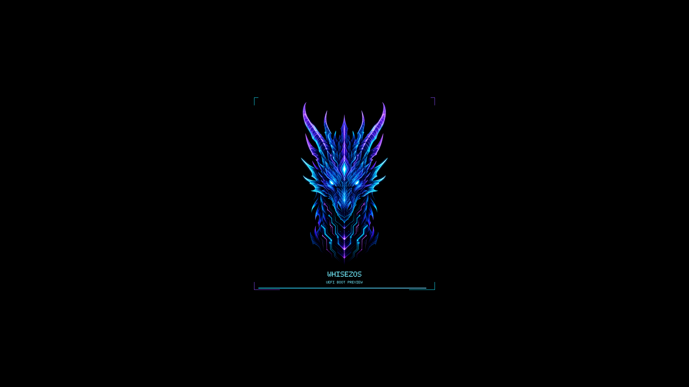
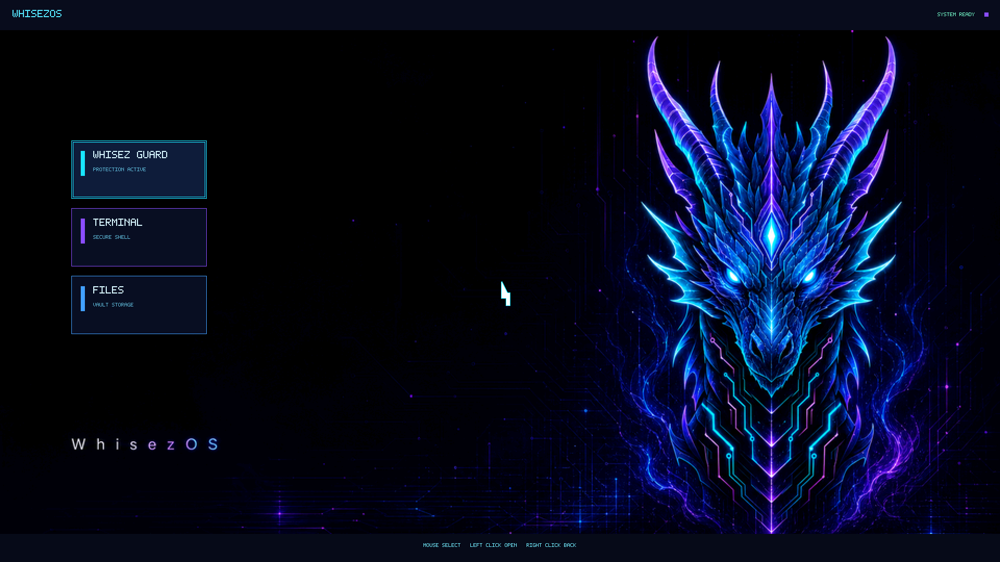
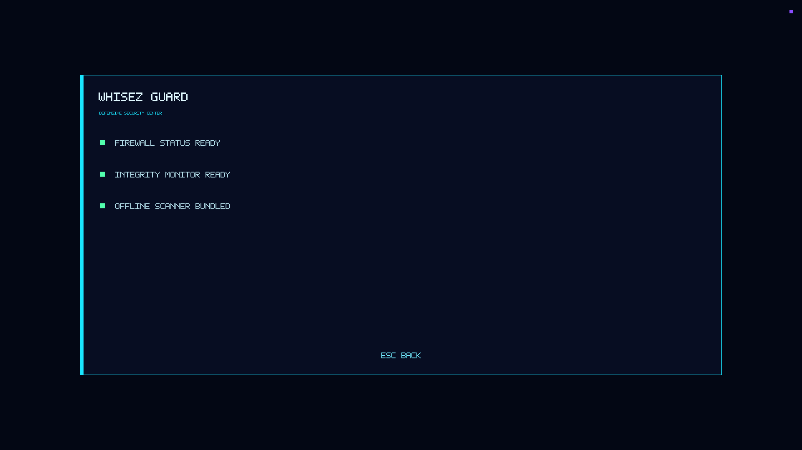

<div align="center">

# WhisezOS

### Rust ile geliştirilen deneysel işletim sistemi ve savunma araçları

**[Türkçe](README.md) · [English](README.en.md)**

[](https://github.com/whisez/WhisezOS/actions/workflows/ci.yml)

[](https://github.com/whisez/WhisezOS/releases/tag/v0.1.0)
[](LICENSE)

</div>

WhisezOS; yetenek tabanlı güvenliği hedefleyen bir Rust mikroçekirdek tasarımı,
QEMU'da çalışan gerçek bir UEFI masaüstü önizlemesi ve yerel savunma aracı
**Whisez Guard** içeren deneysel bir projedir.

> [!WARNING]
> **WhisezOS henüz tamamlanmış bir işletim sistemi değildir.** Proje aktif
> geliştirme aşamasındadır. Yalnızca QEMU sanal makinesinde deneyin; fiziksel
> diske veya gerçek donanıma kurmaya çalışmayın.

## Proje durumu

| Bileşen | Durum | Açıklama |
|---|:---:|---|
| UEFI önizlemesi | ✅ Çalışıyor | QEMU/OVMF üzerinde açılır, WhisezOS animasyonunu ve masaüstünü gösterir |
| Fare ve klavye | ✅ Çalışıyor | Kart seçme, sol tıkla açma, sağ tıkla geri dönme ve klavye kısayolları |
| Whisez Guard | ✅ Çalışıyor | Windows güvenlik denetimi, çevrimdışı tarama, SHA3-256 temel doğrulaması ve izleme |
| Derleme ve paketleme | ✅ Çalışıyor | Tek komutla EFI, Guard ve 4K duvar kâğıdı paketi üretir |
| Otomatik testler | ✅ 234 test | Çekirdek, dosya sistemi, önyükleme mantığı ve Guard testleri |
| Üretim çekirdeği | 🚧 Yapılıyor | Temel mimari mevcut; tam donanım başlatma ve sürücüler tamamlanmadı |
| Masaüstü oturumu | 🚧 Yapılıyor | Önizleme var; gerçek çekirdekten masaüstüne geçiş henüz tamamlanmadı |
| Fiziksel kurulum | ❌ Hazır değil | Disk kurucusu, donanım uyumluluğu ve kurtarma yolu tamamlanmadan kullanılamaz |

Önyükleme önizlemesi, tamamlanmamış üretim yükleyicisinden özellikle ayrı
tutulur. Böylece proje olduğundan daha hazır gösterilmeden UEFI, framebuffer,
girdi, görsel varlık, derleme ve sanal makine yolu gerçek biçimde sınanabilir.

## Görseller







## En kolay deneme yolu

Kod derlemek istemiyorsanız hazır geliştirici paketini indirin:

**[WhisezOS v0.1.0 Developer Preview paketini indir](https://github.com/whisez/WhisezOS/releases/download/v0.1.0/WhisezOS-v0.1.0-developer-preview.zip)**

> Paketteki EFI dosyası doğrudan Windows programı gibi açılmaz. UEFI
> önizlemesini çalıştırmanın önerilen yolu aşağıdaki kaynak kod kurulumudur.

### Windows'ta kaynak koddan çalıştırma

PowerShell veya Windows Terminal'i açın ve gerekli araçları kurun:

```powershell
winget install --id Git.Git --exact
winget install --id Rustlang.Rustup --exact
winget install --id SoftwareFreedomConservancy.QEMU --exact
```

Terminali kapatıp yeniden açın. Ardından projeyi indirip QEMU'da başlatın:

```powershell
git clone https://github.com/whisez/WhisezOS.git
Set-Location WhisezOS
cargo xtask setup
cargo xtask run
```

Bu işlem Windows önyükleyicisini, fiziksel diski veya BIOS/UEFI ayarlarını
değiştirmez. Ayrıntılı anlatım ve sorun çözümleri için
**[Türkçe kurulum rehberini](INSTALL.md)** okuyun. İngilizce anlatım için
**[English installation guide](INSTALL.en.md)** sayfasına geçin.

## Kontroller

- Fareyi bir kartın üzerine getirerek seçin, sol tıkla açın.
- Sağ tık veya `Esc` ile masaüstüne dönün.
- `Yukarı` / `Aşağı` ya da `W` / `S` ile uygulama seçin.
- `Enter` ile seçili uygulamayı açın.
- `1`, `2`, `3` ile Guard, Terminal veya Files uygulamasını doğrudan açın.
- QEMU fareyi yakalarsa `Ctrl+Alt+G` ile serbest bırakın.

## Whisez Guard

Whisez Guard yalnızca yerel ve savunma amaçlı çalışır. İncelediği dosyaları
çalıştırmaz, internete yüklemez, silmez ve otomatik karantinaya almaz.

```powershell
# Windows Firewall, Defender, UAC, Secure Boot ve dinleyen portları denetle
cargo run --release -p whisez-guard -- audit

# Bir klasörü çevrimdışı tara
cargo run --release -p whisez-guard -- scan C:\incelenecek-klasor

# SHA3-256 dosya bütünlüğü temeli oluştur ve doğrula
cargo run --release -p whisez-guard -- baseline C:\onemli --output baseline.json
cargo run --release -p whisez-guard -- verify baseline.json

# Beş saniyede bir tekrar kontrol et
cargo run --release -p whisez-guard -- monitor baseline.json --interval 5
```

Otomasyon için `audit`, `scan` veya `verify` komutuna `--json` ekleyebilirsiniz.

## Geliştirme yol haritası

- [x] QEMU/OVMF üzerinde açılan gerçek UEFI önizlemesi
- [x] Animasyonlu masaüstü, fare ve klavye girdisi
- [x] Whisez Guard savunma aracı
- [x] Tek komutla derleme, test ve geliştirici paketi
- [ ] Üretim yükleyicisinden Rust mikroçekirdeğine tam geçiş
- [ ] Kesme, zamanlayıcı, depolama, ağ ve ekran sürücülerini tamamlama
- [ ] Kullanıcı alanı servisleri ve gerçek masaüstü oturumu
- [ ] Güvenli güncelleme, kurtarma ve disk kurulum sistemi
- [ ] Donanım uyumluluk matrisi ve kararlı sürüm

Bu maddelerin tarih sözü olmadığını unutmayın. Proje araştırma ve geliştirme
aşamasındadır; ilerleme test edilebilir küçük adımlarla yapılır.

## Derleme ve doğrulama

Hazır geliştirici paketi oluşturmak için:

```powershell
cargo xtask bundle
```

Çıktı `dist/WhisezOS` klasörüne yazılır. Tüm desteklenen kontrolleri çalıştırmak
için:

```powershell
cargo xtask test
```

Bu komut 234 testi, çalışır araçlar için Clippy denetimini ve UEFI önizlemesinin
release derlemesini çalıştırır.

## Depo yapısı

```text
boot/spectre-boot/       Üretim yükleyicisi tasarımı ve UEFI önizlemesi
kernel/spectre-kernel/   Yetenekler, IPC, zamanlayıcı, vault ve platform kodu
userland/prism/          Vulkan compositor ve animasyon motoru
userland/whisez-guard/   Çalışan yerel savunma komut satırı aracı
userland/winbridge/      PE yükleyicisi ve Windows uyumluluk çalışmaları
userland/spectreshield/  Sezgisel süreç risk motoru
fs/spectrefs/            Copy-on-write dosya sistemi çalışmaları
assets/wallpapers/       WhisezOS masaüstü görselleri
xtask/                   Derleme, paketleme, test ve QEMU otomasyonu
verify/                  Ana bilgisayarda çalışan mantık testleri
```

Uzun vadeli tasarım için [ARCHITECTURE.md](ARCHITECTURE.md), ayrıntılı üretim
araç zinciri için [BUILD.md](BUILD.md) dosyasına bakın.

## Katkı ve güvenlik

- Katkıda bulunmadan önce [CONTRIBUTING.md](CONTRIBUTING.md) dosyasını okuyun.
- Hata ve özellik istekleri için Türkçe veya İngilizce GitHub Issue formlarını
  kullanın.
- Güvenlik açığını herkese açık issue olarak yazmayın;
  [SECURITY.md](SECURITY.md) içindeki özel bildirim yolunu kullanın.
- Issue veya pull request içine parola, erişim anahtarı, kişisel e-posta,
  kullanıcı klasörü ya da özel dosya içeriği eklemeyin.

## Lisans

WhisezOS, Mozilla Public License 2.0 ile lisanslanmıştır. Ayrıntılar için
[LICENSE](LICENSE) dosyasına bakın.
